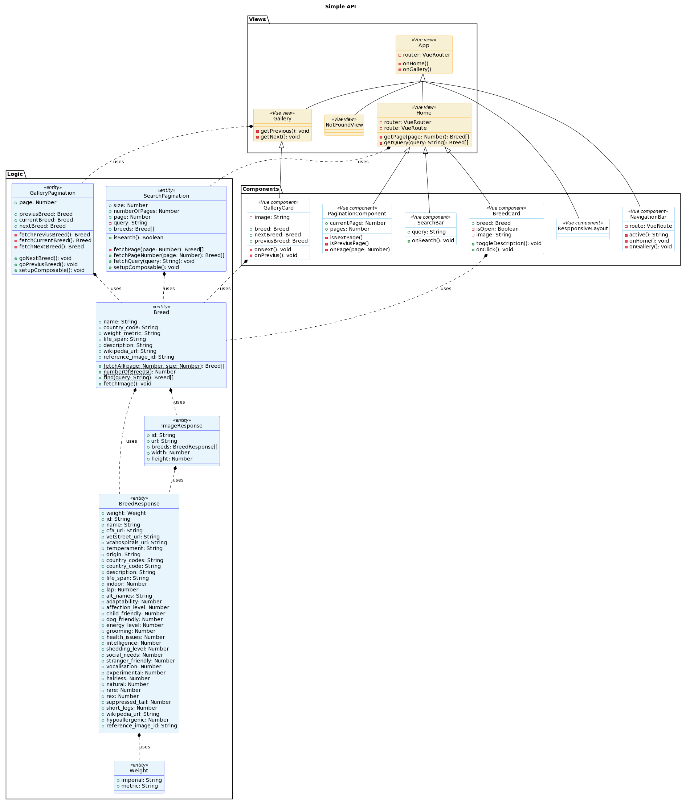

# simple-api

A simple Vue3 web application that uses the [Cat API](https://docs.thecatapi.com/) to display cat images. It allows the user to search for a cat breed and display an image and details about the breed. Additionally, the user can browse all cat breeds using a gallery view.

## Prototypes

### Home page

Home page allows the user to search for a cat breed. The search results are displayed in a gallery. User can opt out of searching for a breed and is able to browse all cat breeds using pagination.


<!--
     https://wireframe.cc/uWSSyq
 -->

### Breed gallery

Breed gallery displays one breed at a time. Unlike the home page, here the user can see more details about the breed and is able to navigate to the next or previous breed.


<!--
    https://wireframe.cc/5wcxdR
 -->

### Page not found

Page not found is displayed when the user navigates to a non-existent page.

<!--
    https://wireframe.cc/ltu7WQ
 -->


### UML class diagram



## Running the app

### Prerequisites

- Node.js version 18 or higher
- npm

### Configuration file

The app requires a configuration file to be present in the root directory. The file should be named `.env` and should contain the following environment variables:

```bash
VITE_APP_API_URL=https://api.thecatapi.com/v1/
```

The `.env` file shoul be placed in the root of VueJS app `src/client/`.

### Installing the app

To install the app, run the following command inside the root directory:

```bash
npm install
```

### Running the app in the development mode

```bash
npm run dev
```

## Testing the app

### Unit testing

The app used Vitest for unit testing. To run the unit tests, run the following command:

```bash
npm run test:unit
```

### E2E testing

Make sure that development server is running before running the E2E tests.

For E2E testing the app uses Cypress. To run the E2E tests, run the following command:

```bash
npm run test:e2e
```

If you prefer to run the tests in the interactive mode, run the following command:

```bash
npm run cypress:open
```
